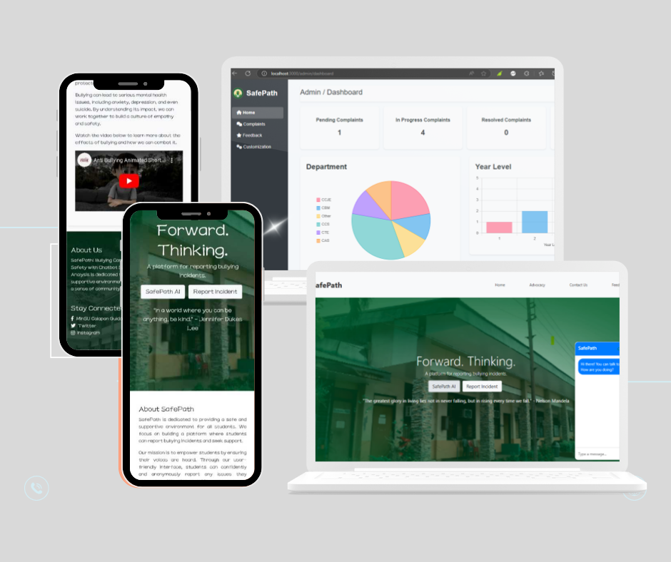

# SafePath: Bullying Complaint System for Student Safety

SafePath is a Node.js-based web application designed to empower students to anonymously report bullying incidents and receive immediate support through an integrated chatbot that utilizes sentiment analysis. Developed by Gwen Basconcillo, Erica Joy Rubio, and Reymel Mislang for our Application Development course at Mindoro State University, SafePath aims to create a safer school environment by enabling proactive measures against bullying.

Note: The live site for this project is currently not functioning, but you can explore our prototype at: https://codewithryry.github.io/minsu-safepath.

## Features
- **Anonymous Reporting**: SafePath ensures students can report bullying incidents without fear of identification, fostering a culture of openness and support. This anonymity encourages more students to speak up and seek help.
- **Sentiment Analysis**: Each report is evaluated for emotional tone, categorizing incidents as severe, mid, or low. This prioritization allows school authorities to address the most critical cases first, ensuring timely intervention.
- **Chatbot Support**: Our AI-powered chatbot engages students with personalized and comforting messages based on the severity of the incident reported. The chatbot serves as a first point of contact, offering reassurance and directing students to appropriate resources.
- **Admin Dashboard**: Administrators can monitor real-time analytics that highlight bullying trends, frequency of incidents, and emotional severity levels. This data-driven approach enables schools to formulate effective anti-bullying strategies.
- **Educational Resources**: SafePath is not just about reporting; it also provides students with valuable articles and tips on handling bullying. Empowering students with knowledge is a crucial step in prevention.
  
## Technologies Used

- Node.js: Backend server to handle requests and run the application.
- Express.js: Web framework for handling routes and views.
- MySQL: Database to store user reports and chatbot interactions.
- Wit.ai: Integrated chatbot for emotional support and guidance based on sentiment analysis.
- Bootstrap: Front-end framework for responsive design.
- Tensorflow: Machine learning library used for building models to analyze and predict user behavior or sentiment.
- Vader-sentiment: A Python library for sentiment analysis that uses a pre-built lexicon and rules to determine the emotional tone (positive, negative, or neutral) of short texts. It’s effective for analyzing informal language, including slang, emojis, and hashtags, making it ideal for chatbot interactions and user feedback analysis.
- SMTP4dev: SMTP server for testing and debugging email functionalities, particularly for the "forgot password" feature.
- GoogleEmail:likely refers to using Google's Gmail service for email sending and receiving, which can be done using Nodemailer with Gmail’s SMTP configuration.
- Nodemailer: is an essential tool for applications that need to send emails, such as for user registration, password resets, complaint confirmations, notifications, etc


## What You Can Do with This Project

- Learn Node.js: SafePath provides a hands-on example of building a full-stack web application, perfect for beginners looking to deepen their understanding of Node.js.
- Explore Backend Development: Dive into the codebase to modify existing features, add new functionalities, or improve performance, enhancing your backend development skills.
- Contribute: We welcome contributions! Feel free to fork the repository, suggest enhancements, or adapt SafePath for other applications, such as community support systems or wellness initiatives
- Future Enhancements (Vue.js & Firebase): In the future, SafePath will integrate Vue.js for building a responsive and dynamic frontend, and Firebase for enhanced backend services, including real-time data storage, authentication, and more.

## UI Preview



The above mockup demonstrates the student dashboard for SafePath, featuring an anonymous reporting form, chatbot support, and complaint analytics.

## Cloning the Repository

To clone the SafePath project repository, follow these steps:

1. Open your terminal or command prompt.
2. Navigate to the directory where you want to clone the project.
3. Run the following command:

   ```bash
   git clone https://github.com/codewithryry/safepath.git

4. Change into the project directory:

   ```bash
    cd safepath
5. Install the necessary dependencies:
    ```bash
    npm install
6. Start the application:
   ```bash
    npm start

